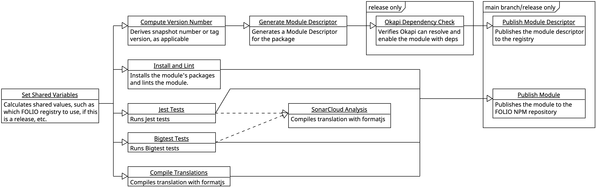

# Centralized UI Workflows

- [Methodology](#methodology)
- [Versioning](#versioning)
- [Using in your repository](#using-in-your-repository)
- [Configuration](#configuration)
  - [Node/Yarn configuration](#nodeyarn-configuration)
  - [Linting](#linting)
  - [Unit tests](#unit-tests)
    - [Jest](#jest)
    - [Bigtest](#bigtest)
  - [Sonarcloud](#sonarcloud)
  - [Translations](#translations)
  - [Module descriptor generation](#module-descriptor-generation)
  - [Module publication](#module-publication)
- [Secrets](#secrets)

To improve the consistency and reliability of the CI/CD workflows for the FOLIO front-end repositories, we are migrating to a centralized workflow. This enables more frequent and centralized updates, encourages shared standards, and reduces the maintenance burden on individual repositories.

## Methodology

By separating each step into its own job, we can run them in parallel, which should speed up the overall process. This also allows us to easily add new steps in the future, and to run only the steps that are necessary for a given change.

Here are all of the individual jobs and how they interact:



## Versioning

TODO: handle versioning of central workflow with tags? branches? semver? flower names? R#-20##?

## Using in your repository

To use the centralized workflow in your repository, you need to create a `.github/workflows` directory in the root of your repository, and add a file `ui.yml` with the following content:

```yaml
# todo: better name?
name: Centralized workflow test
on:
  # todo: what would be best here?
  - push
  - pull_request
  - workflow_dispatch

jobs:
  ui:
    # Use the shared workflow from https://github.com/folio-org/.github
    uses: folio-org/.github/.github/workflows/ui.yml@stripes-904
    # Only handle push events from the main branch, to decrease noise
    if: github.ref_name == github.event.repository.default_branch || github.event_name != 'push'
    secrets: inherit
```

And that's it! Now your repository will use the centralized workflow.

## Configuration

There are many configuration variables, to allow customization of the workflow to your repository. To use these, add inputs under `with:` in the workflow, for example:

```yaml
# ...
if: github.ref_name == github.event.repository.default_branch || github.event_name != 'push'
secrets: inherit
with:
  jest-test-command: yarn test --ci --color --coverage
```


> [!CAUTION]
> In general, **it is preferred that you alter your repository to not need to customize the workflow**, particularly for file paths for coverage/etc. This will make it easier to update the workflow in the future, and will help to standardize the CI/CD process across the FOLIO front-end repositories.

### Node/Yarn configuration

| Input                 | Type    | Default                                                                                                                 | Description                                                                                         |
| --------------------- | ------- | ----------------------------------------------------------------------------------------------------------------------- | --------------------------------------------------------------------------------------------------- |
| `node-version`        | string  | `18.x`                                                                                                                  | The Node version to install                                                                         |
| `folio-npm-registry`  | string  | `https://repository.folio.org/repository/npm-folioci/` or `https://repository.folio.org/repository/npm-folio/` for tags | The repository to pull `@folio/` packages from                                                      |
| `debug-yarn-packages` | boolean | `false`                                                                                                                 | If CI is failing, enable this to list all installed packages/versions and always publish yarn.lock. |

### Linting

| Input               | Type    | Default | Description                                                  |
| ------------------- | ------- | ------- | ------------------------------------------------------------ |
| `allow-lint-errors` | boolean | false   | If set to `true`, PRs will not be blocked by linting errors. |

### Unit tests

Jest, Bigtest, or both can be run as part of the workflow. The default is to run only Jest; you can change this via `jest-enabled` and `bigtest-enabled`. If you need both, they should be runnable as separate commands (set via `jest-test-command` and `bigtest-test-command`).

#### Jest

| Input                      | Type    | Default                    | Description                                                                                                     |
| -------------------------- | ------- | -------------------------- | --------------------------------------------------------------------------------------------------------------- |
| `jest-enabled`             | boolean | `true`                     | Whether to run Jest tests                                                                                       |
| `jest-test-command`        | string  | `yarn test`                | The command to use to run Jest tests                                                                            |
| `jest-junit-output-dir`    | string  | `artifacts/jest-junit`     | Directory where Jest reports are stored, without a trailing slash                                               |
| `jest-coverage-report-dir` | string  | `artifacts/coverage-jest/` | Directory in which Jest coverage reports are stored in, with trailing slash; LCOV data should be in "lcov.info" |

#### Bigtest

| Input                         | Type    | Default               | Description                                                                                                     |
| ----------------------------- | ------- | --------------------- | --------------------------------------------------------------------------------------------------------------- |
| `bigtest-enabled`             | boolean | `false`               | Whether to run Bigtest tests                                                                                    |
| `bigtest-test-command`        | string  | `yarn test`           | The command to use to run Bigtest tests                                                                         |
| `bigtest-junit-output-dir`    | string  | `artifacts/runTest`   | Directory where Bigtest reports are stored, without a trailing slash                                            |
| `bigtest-coverage-report-dir` | string  | `artifacts/coverage/` | Directory in which Jest coverage reports are stored in, with trailing slash; LCOV data should be in "lcov.info" |

### Sonarcloud

| Input              | Type   | Default   | Description                                                                                                                                                                                                                                 |
| ------------------ | ------ | --------- | ------------------------------------------------------------------------------------------------------------------------------------------------------------------------------------------------------------------------------------------- |
| `sonar-sources`    | string | `./src`   | A comma-separated list of directories containing code to analyze (no wildcards or whitespace); see [Sonar's documentation](https://docs.sonarsource.com/sonarcloud/advanced-setup/analysis-parameters/#analysis-scope) for more information |
| `sonar-exclusions` | string | See below | A comma-separated list of wildcards to exclude from analysis. You can use whitespace as needed for formatting.                                                                                                                              |

<details>
<summary>Default value for `sonar-exclusions`</summary>

The comments (lines starting with `#`) are not part of the value, but are included here for clarity.

```
 # documentation
docs/**,
examples/**,
**/*.md,
**/stories/*.js,
**/.stories.js,
**/stories/*.tsx?,
**/.stories.tsx?,
LICENSE,

 # build/CI artifacts
artifacts/**,
ci/**,
node_modules/**,

 # tests
**/tests/**,
**/test/**,
resources/bigtest/interactors/**,
resources/bigtest/network/**,
*-test.js,
*-test.tsx?,
*.test.js,
*.test.tsx?,
karma.conf.js,
karma.conf.tsx?,
jest.config.js,
jest.config.tsx?,

 # misc
*.css,
*.json,
```

</details>

### Translations

| Input                  | Type    | Default | Description                                                                                              |
| ---------------------- | ------- | ------- | -------------------------------------------------------------------------------------------------------- |
| `compile-translations` | boolean | `true`  | Whether to compile translation files; if disabled, none will be included in the published module, either |

### Module descriptor generation

| Input                        | Type    | Default                                | Description                                                               |
| ---------------------------- | ------- | -------------------------------------- | ------------------------------------------------------------------------- |
| `generate-module-descriptor` | boolean | `true`                                 | Whether to generate a module descriptor (will be included in NPM package) |
| `publish-module-descriptor`  | boolean | `true`                                 | Whether to publish the module descriptor to `module-descriptor-registry`  |
| `module-descriptor-registry` | string  | `https://folio-registry.dev.folio.org` | The Okapi instance to publish module descriptors to                       |

### Module publication

| Input                     | Type   | Default                                                                                            | Description                                                                                                                            |
| ------------------------- | ------ | -------------------------------------------------------------------------------------------------- | -------------------------------------------------------------------------------------------------------------------------------------- |
| `folio-npm-registry-auth` | string | `//repository.folio.org/repository/npm-folioci/` or `//repository.folio.org/repository/npm-folio/` | The key to store the authentication under for the FOLIO NPM registry                                                                   |
| `publish-exclusions`      | string | `artifacts`, `.github`, and `.scannerwork`                                                         | A newline-separated list of files and directories to leave out of the published package, in addition to your repository's `.npmignore` |

## Secrets

These are automatically passed from your repository by adding `with: secrets` to the workflow; they are here solely for documentation.

| Secret                    | Description                               |
| ------------------------- | ----------------------------------------- |
| `SONAR_TOKEN`             | Token for performing SonarCloud analysis  |
| `DOCKER_USER`             | Username for pulling Okapi docker image   |
| `DOCKER_PASSWORD`         | Password for pulling Okapi docker image   |
| `NPM_TOKEN`               | Token for publishing to NPM               |
| `FOLIO_REGISTRY_USERNAME` | Username for publishing module descriptor |
| `FOLIO_REGISTRY_PASSWORD` | Password for publishing module descriptor |
